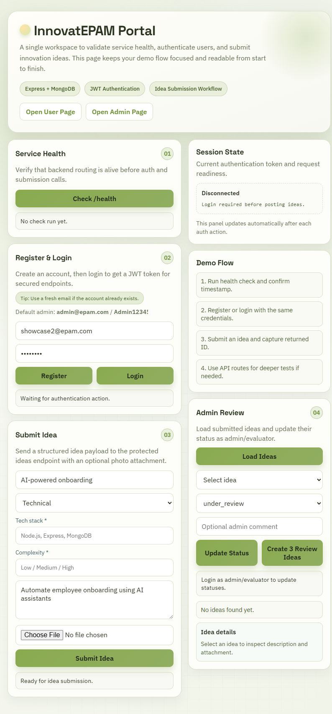
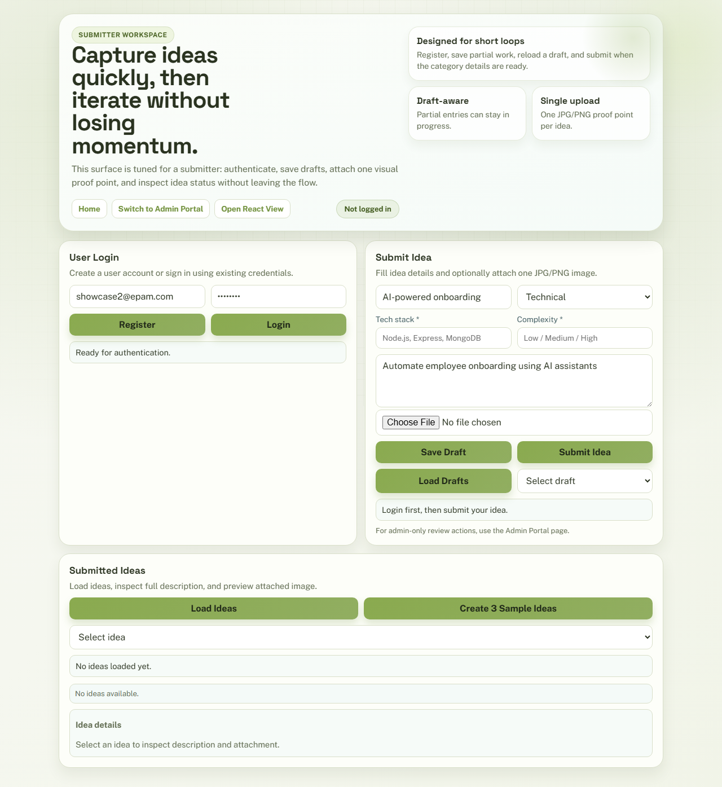
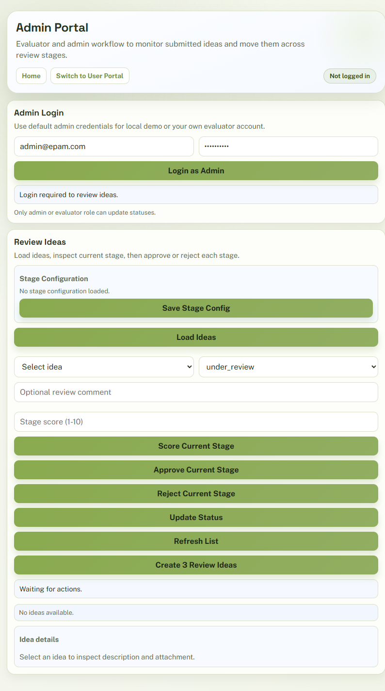
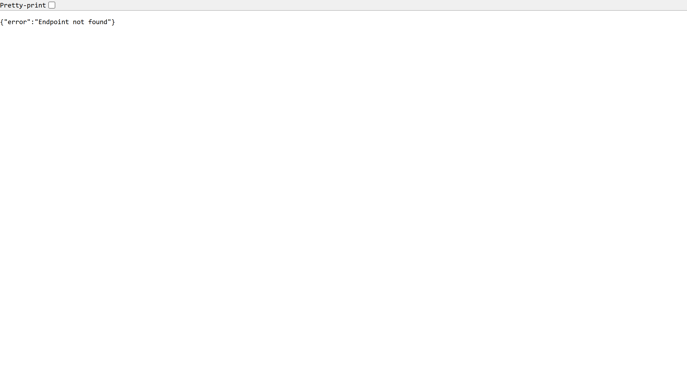
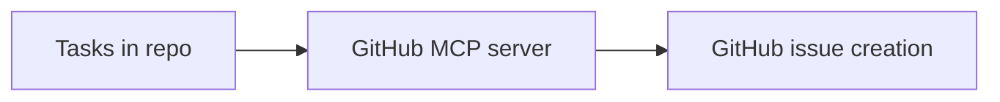

# InnovatEPAM Portal - Quick Reference

## Status
Current project state:
1. Phase 1 Core Portal: Complete
2. Phase 2 Smart Submission Forms: Complete
3. Phase 3 Multi-Media Support: Partial (single attachment flow active)
4. Phase 4 Draft Management: Complete
5. Phase 5 Multi-Stage Review: Complete
6. Phase 6 Blind Review: Complete
7. Phase 7 Scoring System: Complete

Quality snapshot:
1. Tests: 59/59 passing
2. Test suites: 4/4 passing
3. Workflow: Spec-Driven Development (SDD)

## Quick Start
Install and run:
```bash
npm install
npm start
```

Run tests:
```bash
npm test -- --runInBand
```

Useful pages:
1. Home: http://localhost:3000/
2. User Portal: http://localhost:3000/user
3. Admin Portal: http://localhost:3000/admin
4. React App (built): http://localhost:3000/app
5. Speckit Proof: http://localhost:3000/speckit-proof
6. MCP Proof: http://localhost:3000/mcp-proof
7. Health: http://localhost:3000/health

React + Vite frontend:
```bash
# Start backend + Vite dev server together
npm run dev:full

# Build React app for Express /app route
npm run client:build
```

## Screenshots

Portal screens:

Home page:



User portal:



Admin portal:



Proof screens:

Speckit proof:



MCP proof:


## Core Capabilities
Auth and roles:
1. Register, login, logout
2. JWT auth
3. Roles: submitter, evaluator, admin

Idea management:
1. Submit idea with category-aware validation
2. List ideas with status and stage context
3. View full detail
4. Download attachment

Draft lifecycle:
1. Save draft with partial fields
2. List drafts for current user
3. Edit draft
4. Submit draft with full validation

Review workflow:
1. 4-stage pipeline: Screening, Technical, Business Impact, Final Decision
2. Stage decisions: approve/reject
3. Stage config: enable/disable stages
4. Blind mode: per-stage identity masking for evaluator view
5. Scoring: stage score (1-10) + aggregate score summary

## API Overview
Authentication:
1. POST /api/auth/register
2. POST /api/auth/login
3. POST /api/auth/logout

Ideas and drafts:
1. POST /api/ideas
2. GET /api/ideas
3. GET /api/ideas/:id
4. PUT /api/ideas/:id/status
5. GET /api/ideas/:id/file
6. POST /api/ideas/drafts
7. GET /api/ideas/drafts
8. PUT /api/ideas/drafts/:id
9. POST /api/ideas/drafts/:id/submit

Stages and scoring:
1. GET /api/ideas/stages/config
2. PUT /api/ideas/stages/config
3. PUT /api/ideas/:id/stages/decision
4. PUT /api/ideas/:id/stages/score

## Notes
1. If MongoDB is unavailable, the app continues in in-memory fallback mode.
2. This keeps demo and local verification flows usable without Atlas connectivity.

## MCP / Automation
1. The task-to-issues agent uses the GitHub MCP server with `github/github-mcp-server/issue_write`.
2. It is intended to convert tasks into dependency-ordered GitHub issues for the repository that matches the configured Git remote.



Evidence: [InnovatEPAM-Portal/.github/agents/speckit.taskstoissues.agent.md](InnovatEPAM-Portal/.github/agents/speckit.taskstoissues.agent.md)

## Key Documents
1. [CHANGELOG.md](CHANGELOG.md)
1. [PROJECT_SUMMARY.md](PROJECT_SUMMARY.md)
2. [DEMO_SCRIPT.md](DEMO_SCRIPT.md)
3. [docs/PRD.md](docs/PRD.md)
4. [docs/STORIES.md](docs/STORIES.md)
5. [docs/CONSTITUTION.md](docs/CONSTITUTION.md)
6. [docs/AGENTS.md](docs/AGENTS.md)
7. [docs/adr/](docs/adr/)
